# 1조 쉬러왔서영

---

## Index
- [프로젝트 소개](#프로젝트-소개)
  - [프로젝트 기간](#프로젝트-기간)
  - [기술 스택](#기술-스택)
  - [팀원 역할](#팀원-역할)
- [프로젝트 설계](#프로젝트-설계)
  - [시스템 구성](#시스템-구성)
  - [기능 리스트](#기능-리스트)
  - [Map](#map)
- [다중 로봇 제어](#다중-로봇-제어)
  - [Multi-Robot Control](#multi-robot-control)
  - [Task Planning](#task-planning)
    - [작업 요청 시나리오](#작업-요청-시나리오)
    - [작업 스케줄링 시나리오](#작업-스케줄링-시나리오)
    - [작업 수행 시나리오](#작업-수행-시나리오)
- [Navigation](#navigation)
  - [A* Path Planning](#a-path-planning)
  - [이슈 처리](#이슈-처리)
- [딥러닝 요소](#딥러닝-요소)
  - [Following: 사람 추적 기능](#following-사람-추적-기능)
  - [안전 기능: 쓰러진 보행자 인식](#안전-기능-쓰러진-보행자-인식)
- [결론](#결론)
  - [결과 요약](#결과-요약)
  - [회고](#회고)

---

## 프로젝트 소개
요양원 업무 보조를 위한 <b>다중 주행 로봇 제어 시스템</b>

  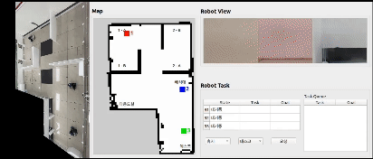

### 프로젝트 기간
2023.12.26 ~ 2024.01.25

### 기술 스택
|   |   |
|---|---|
|개발환경|    ||
|기술|     |
|커뮤니케이션|  |

### 팀원 역할

|구분|이름|역할|
|---|---|---|
|팀장|조태상|Map 구축, SLAM, Camera Calibration, Aruco Marker Detection|
|팀원|강소희|GUI 설계 및 디자인, Map 구축|
|팀원|강한얼|딥러닝 활용 Following mode, 보행자 쓰러짐 인식 기능 개발|
|팀원|문서영|Map 구축, SLAM, 딥러닝 활용 Following mode|
|팀원|오윤|Multi Robot Control, Task Planning, DB Query/SP 작성, GUI 경로 표시|
|팀원|조홍기|A* Path Planning, 로봇 주행, Multi Robot Spawn 시도|

---

## 프로젝트 설계

### 시스템 구성

  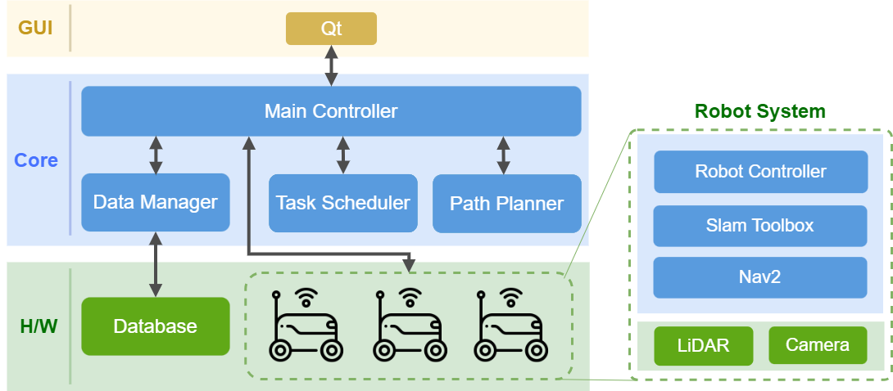

### 기능 리스트

  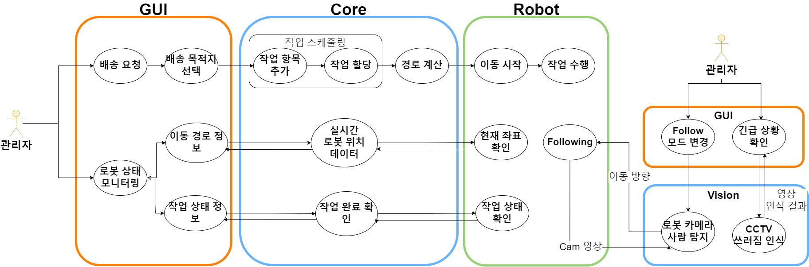

### Map

  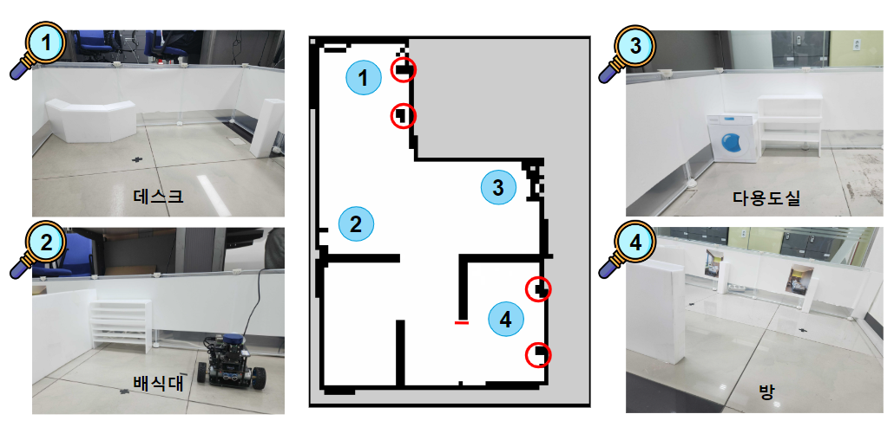

### 데이터구조

  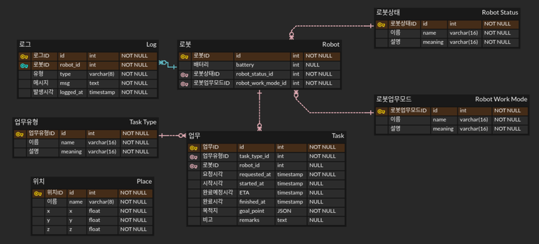

### GUI

  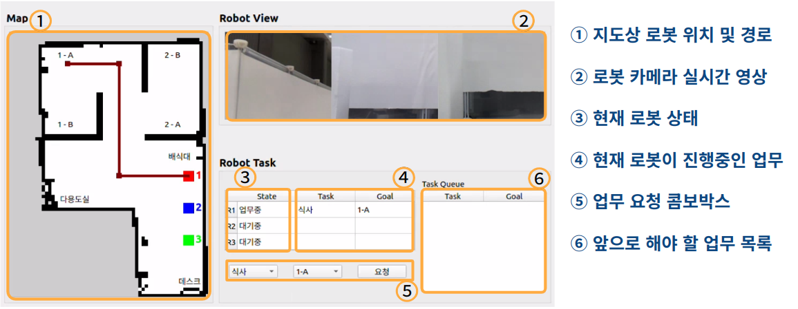

---

## 다중 로봇 제어

### Multi-Robot Control

  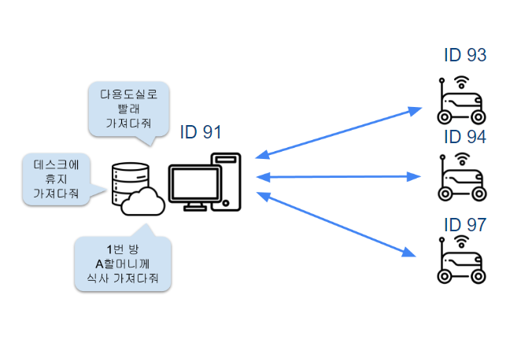

### Task Planning
#### 작업 요청 시나리오

  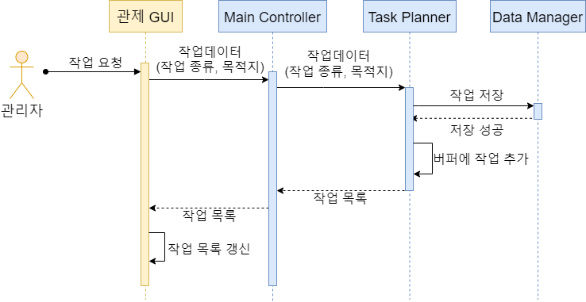

#### 작업 스케줄링 시나리오

  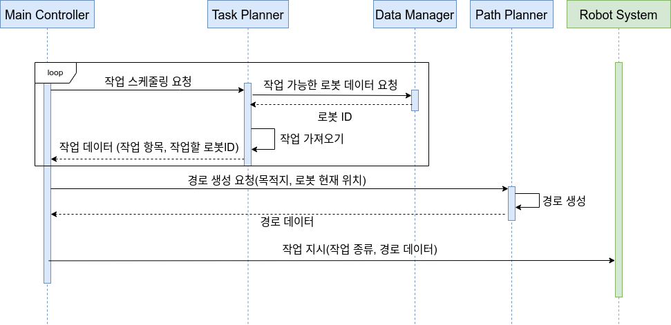

#### 작업 수행 시나리오

  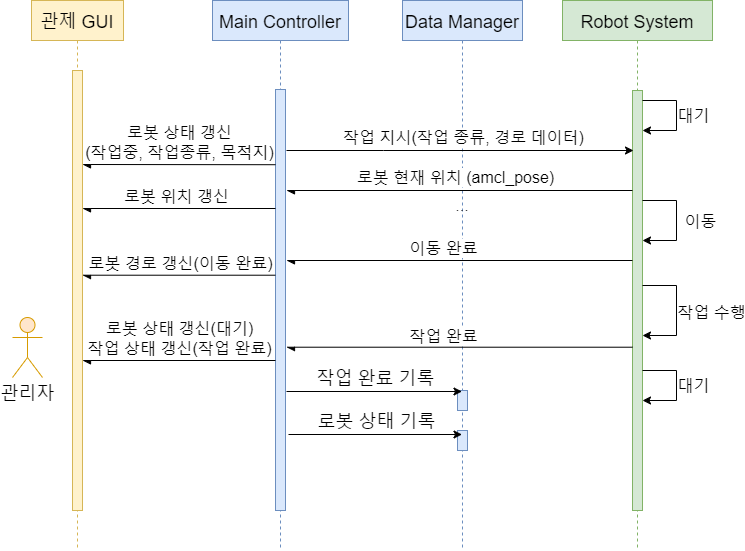

---

## Navigation

### A* Path Planning

- Sequence Diagram

  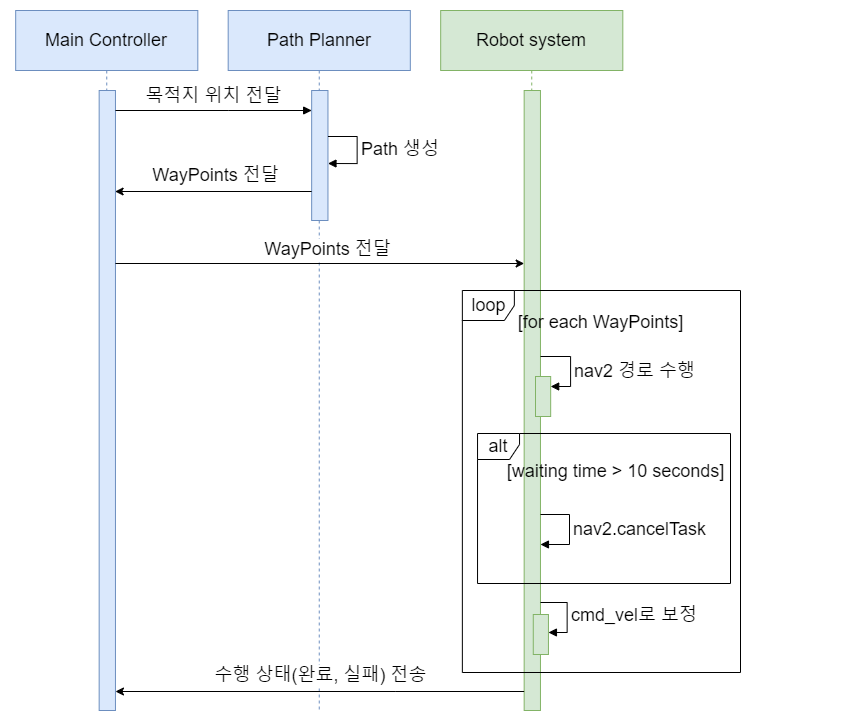

### 이슈 처리

- 안전 주행을 위한 장애물 Padding 처리

  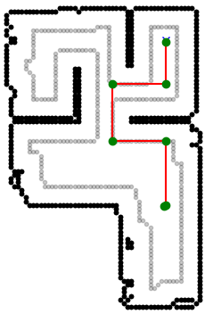

- Behavior Tree 개선 및 cmd_vel 조정을 통한 Timeout 상태 탈출

  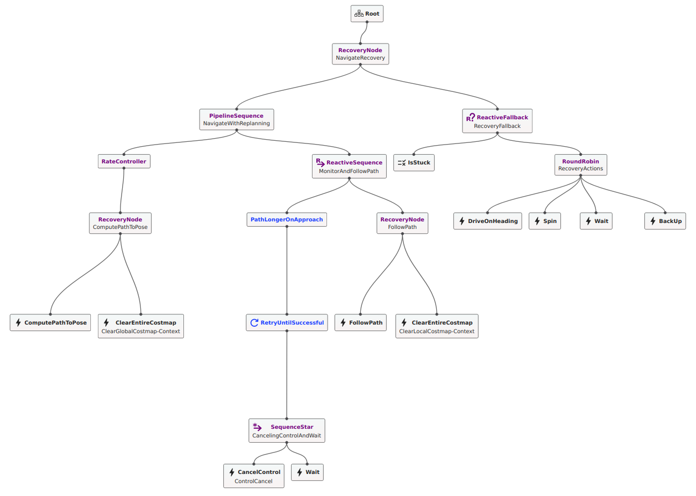

---

## 딥러닝 요소

### Following: 사람 추적 기능

### 안전 기능: 쓰러진 보행자 인식

---

## 결론

### 결과 요약

- __Navigation
  - A* Path Planning
  - 장애물 Padding, 오차 보정을 통한 안전하고 정확한 주행
  - Behavior Tree를 사용하여 동적/정적 장애물 회피 및 고착 상태 탈출

- __다중 로봇 제어__
  - 서로 다른 도메인ID 간 통신 가능하게 하여 하나의 맵에서 다수의 로봇을 제어
  - 로봇 상태별 스케줄링

- __딥러닝 요소__
  - 딥러닝 기반의 영상 인식을 활용한 사람 추적 및 보행자 쓰러짐 인식 기능

### 회고
- 보다 다양한 시나리오에서 장애물 회피 로직을 구현해보고 싶습니다.
- 라이다와 엔코더 이외에도 여러 개의 센서를 사용하여 Localization에 활용해보고 싶습니다.
- Jira, Confluence 등의 협업 툴을 사용해보는 기회가 되었습니다.
- ROS2 topic을 통해 GUI로 다양한 기능을 보여줄 수 있어 재밌었습니다.
